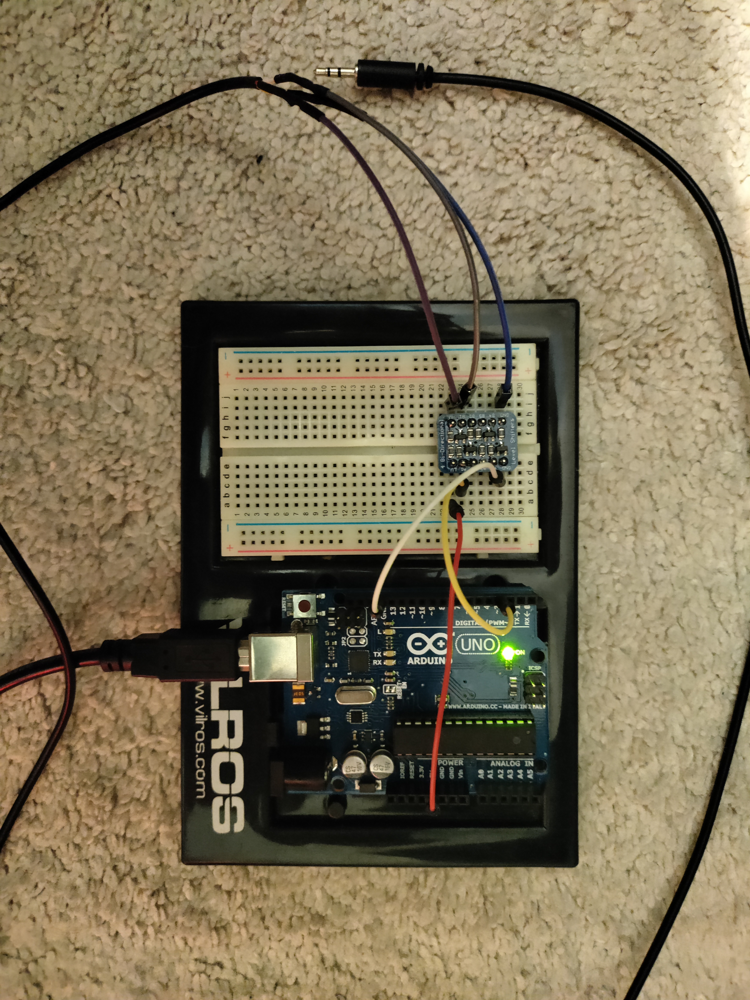

# Hi8 LANC Tool

This tool will help extract the date/time information from a Hi8 tape.

Not all Hi8 tapes had this information on the tape and only certain camcorders have LANC control (read more here octochron.com/faqProduct.htm).

## Steps

### 1. Build a USB to LANC Adapter

You will need to build one of these yourself.
This page has good instructions on how to build one. [https://github.com/Novgorod/LANC-USB-GUI](https://github.com/Novgorod/LANC-USB-GUI)

Alternatively, a more simple circuit can be built using logic-level converter. However because of the strict timing requirements of LANC, I could only get it to work for reading LANC and not sending commands (I used Adafruit's "4-channel I2C-safe Bi-directional Logic Level Converter - BSS138"). See image:

### 2. Flash firmware to the USB to LANC Adapter

This can be done by downloading the Arduino IDE and flashing "arduino_atmega328.ino" or "arduino_nano_every_atmega4809.ino" depending on which board you use.

### 3. Record LANC packets / View Results

Use this repo's web app to record and view the LANC data (using the Web Serial API). Detailed instructions are found on the web app.

